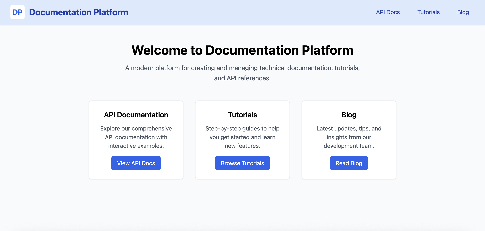

## Documentation Platform (Nuxt 4)

Hi! If you want to quickly get a short view of this demo and performance scores, please check this video:
[📹 Demo & Performance Overview](https://www.loom.com/share/de38f3950883464290ccbfef29122a4b?sid=89d8c272-9bb9-4257-aa2c-786c45615db2)

### Screenshots



> Tip: place your images in `public/screenshots/` with names like `home.png`, `tutorials.png`, `api.png`, `blog.png`.

### What you'll get
- **Blog**: Markdown files in `content/blog` rendered as a list and detail pages
- **Tutorials**: Markdown files in `content/tutorials`
- **API Docs**: Swagger UI at `/api` loading spec from `public/api/api-specification.json`
- **Branding**: Switch look-and-feel via `runtimeConfig.public.branding` in `nuxt.config.ts` (`startup`, `techcorp`, or `default`)

## Prerequisites
- **Node.js**: 18.20+ or 20+ (LTS recommended)
  - Check your version:
  ```bash
  node -v
  ```
  - If needed, install with `nvm`:
  ```bash
  # install and use latest LTS
  nvm install --lts
  nvm use --lts
  ```
- **npm** comes with Node. (You can also use pnpm/yarn if you prefer.)

## Quick start
```bash
# 1) Clone the repo
git clone git@github.com:linx777/doc_platform.git

# 2) Go to the app
cd doc_platform

# 3) Install dependencies
npm install

# 4) Start the dev server (default branding)
npm run dev
```

Open `http://localhost:3000` in your browser.

### Choose a branding (optional)
Available brand keys are defined in `branding.config.ts`: `startup`, `techcorp`, `default`.

To change the active brand:
1. Open `nuxt.config.ts`.
2. Find `runtimeConfig.public.branding`.
3. Set it to your desired brand key (e.g. `startup`, `techcorp`, or `default`).

Example:
```ts
export default defineNuxtConfig({
  // ...other config
  runtimeConfig: {
    public: {
      branding: 'techcorp'
    }
  }
})
```

Restart the dev server after changing this value.

## Project structure (high level)
- `pages/`
  - `index.vue`: Home
  - `api/index.vue`: Swagger UI page
  - `blog/`: List and `[slug]` detail pages
  - `tutorials/`: List and `[slug]` detail pages
- `server/api/`
  - `blog.get.ts` and `blog/[slug].get.ts`
  - `tutorials.get.ts` and `tutorials/[slug].get.ts`
- `content/`
  - `blog/*.md`, `tutorials/*.md`
  - `api/api-specification.json` (reference copy) and `public/api/api-specification.json` (served)
- `components/`
  - `SwaggerUI.vue`, `AppHeader.vue`, and content components
- `branding.config.ts`: Theme presets used by the header and UI
- `nuxt.config.ts`: Nuxt setup and default `branding`

## Working with content (Markdown)
Add new files under `content/blog` or `content/tutorials`. Frontmatter is optional but recommended:
```md
---
title: My First Post
date: 2025-01-01
author: Jane Doe
tags: [getting-started, docs]
---

Write your markdown content here. Headings, lists, and code blocks are supported.
```

- The filename (without `.md`) becomes the URL slug (sanitized).
- Lists are loaded from `/api/blog` and `/api/tutorials`.
- Detail pages fetch `/api/blog/:slug` and `/api/tutorials/:slug`.

## API documentation (Swagger UI)
- Visit `http://localhost:3000/api` to view the Swagger UI.
- The UI loads the spec from `public/api/api-specification.json`.
- Update that file to change the docs. You can copy from `content/api/api-specification.json` if needed.

## Build for production
```bash
npm run build
npm run preview
```
Then open the printed local URL to preview the production build.

## Troubleshooting
- **Port already in use**: Stop the process using port 3000 or run with `PORT=3001 npm run dev`.
- **Node version issues**: Ensure Node 18.20+ or 20+. Use `nvm use --lts`.
- **Clean reinstall**:
  ```bash
  rm -rf node_modules .nuxt
  npm install
  npm run dev
  ```
- **Swagger not loading**: Confirm `public/api/api-specification.json` exists and is valid JSON.

## Learn more
- Nuxt docs: `https://nuxt.com/docs/getting-started/introduction`
- @nuxt/content: `https://content.nuxt.com/`
